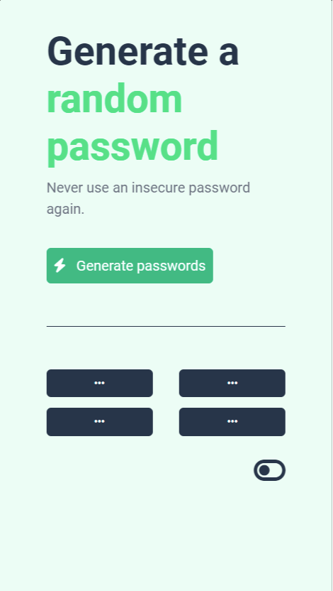

# Random Password Generator

Generate secure and random passwords easily with this simple web-based tool.

 

 

## Demo
Check out the live demo [here](https://passcogen.ccbp.tech/).

## Features
- Generate random passwords instantly
- Simple and intuitive user interface
- Dark/Light theme toggle for better user experience
- Utilizes a strong character set for password generation

## How to Use
1. Open the [Random Password Generator](https://passcogen.ccbp.tech/).
2. Click on the "Generate passwords" button to generate new random passwords.
3. Passwords will be displayed in the four password boxes.
4. Toggle between dark and light themes using the theme toggle button.

## Technologies Used
- HTML
- CSS (Bootstrap)
- JavaScript

## Development Setup
1. Clone the repository:
   ```bash
   git clone https://github.com/yourusername/random-password-generator.git
   
## License
This project is licensed under the MIT License.

## Credits
- Project inspired by Scrimba
- Built by Havishya
- Icons from Font Awesome
